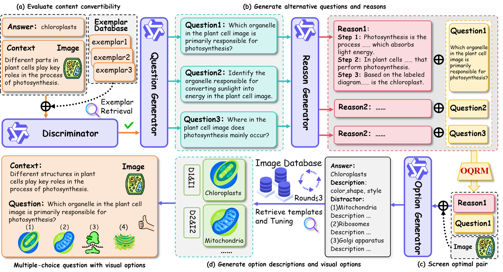

# Beyond the Textual: Generating Coherent Visual Options for MCQs
Cross-modal Options Synthesis (CmOS) is a multimodal educational question generation with visual options framework, integrating Multimodal Chain-of-Thought (MCoT) reasoning with Retrieval-Augmented Generation (RAG) to generate MCQs with visual options. Specifically, the framework employs an Multimodal Large Language Model (MLLM) to encode multimodal content and embeds it into a four-stage MCoT architecture that separates content discrimination, question and reason generation, alternative pairs screening, and visual options generation. To improve the quality of visual options, we leverage RAG to retrieve similar images from an external educational image database as templates for generation, and then the MLLM and the T2I model are required to optimize based on the templates.


# Requirements
python 3.11 and above

# Quickstart
Below, we provide simple examples to show how to use CmOS.
Before running the code, make sure you have setup the environment and installed the required packages. Make sure you meet the above requirements, and then install the dependent libraries.
```python
pip install -r requirements.txt
```
1. To determine whether a question is suitable for conversion into a visual multiple-choice format using a multimodal large language model (MLLM), you can run the following script:
```python
   python discrimination.py
```
Prerequisites: (1) exemplar.csv — exemplar questions dataset (2) test.csv — test questions dataset (3) configured MLLM API access (e.g., API key).
3. If you want to use our question generator, you need to run:
```python
  question_generation.py
```
Note that you also need to provide everything required to run this code, including the API, test file, and output path.
4. After generating questions and reasoning, you need to run the OQRM module to select the best questions.
```python
   python oqrm.py
```
The hyperparameter is set to α=0.6, and the specific script is `screen_altenative.py`.
5. If you want to generate textual options for the questions, you need to run `option_generation.py`, and similarly, you need to provide the API, test file, and output path.
```python
   option_generation.py
```
6. If you want to generate suitable visual images for the textual options, you need to run `visual_option_generation.py`.
```python
   visual_option_generation.py
```
The hyperparameter is set to β=1.4. You must provide an image library, the APIs for both the MLLM and the image generation model, as well as the input and output files.

